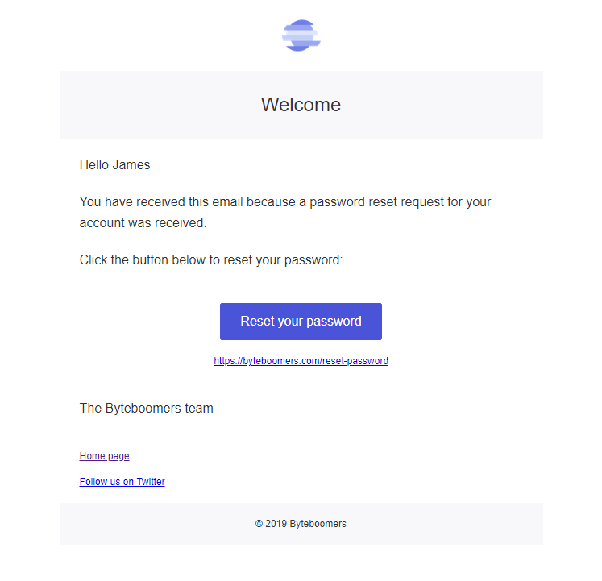

# mermail

Generate responsive transactional HTML emails 🧜📧

## About

This library was inspired by [mailgen](https://github.com/eladnava/mailgen) but uses MJML JSON definitions instead of the EJS templating language.

## Installation

```bash
npm install mermail mjml
```

[npm package link](https://www.npmjs.com/package/mermail)

## Example

```javascript
const mermail = require("mermail");

const html = mermail.simple({
  logo: "https://cdn.byteboomers.com/img/logo/png/byteboomers--64x64.png",
  title: "Welcome",
  intro: [
    "Hello James",
    "You have received this email because a password reset request for your account was received.",
    "Click the button below to reset your password:"
  ],
  cta: {
    text: "Reset your password",
    link: "https://byteboomers.com/reset-password"
  },
  outro: ["The Byteboomers team"],
  links: [
    {
      text: "Home page",
      link: "https://byteboomers.com"
    },
    {
      text: "Follow us on Twitter",
      link: "https://twitter.com/byteboomers"
    }
  ],
  copyright: "© 2019 Byteboomers"
});
```


